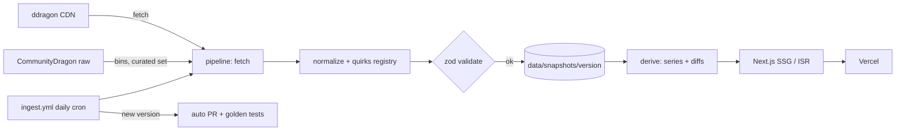

# Riftline — Architecture

> Companion docs: [PLAN.md](./PLAN.md) · [ADRs](./docs/adr) · [CLAUDE.md](./CLAUDE.md)
>
> **Status:** living document · **Last updated:** 2026-07-17

## 1. System overview

The architectural centerpiece is a **snapshot pipeline, not a proxy**. Riot's static data is ingested, normalized, validated, and committed as versioned JSON that this repo owns; the site builds from those snapshots. There is no runtime dependency on Riot's CDN except image hotlinks — the site keeps working through Riot outages, publish lags, and upstream format changes.



## 2. Repository layout (pnpm workspaces)

```
apps/web/                 Next.js app (App Router)
packages/schema/          zod schemas + TS types — the shared contract
packages/engine/          damage math: pure, deterministic, framework-free
packages/pipeline/        ETL CLIs: fetch, normalize, validate, emit, derive
packages/ui/              design tokens + accessible components; Storybook workshop (ADR-004)
data/snapshots/{version}/ normalized champions.json, items.json, meta.json
data/curated/{slug}.json  ability formulas + provenance (curated set)
data/series/{slug}.json   precomputed per-champion time series
data/goldens/{slug}.json  golden test fixtures (verified flag per fixture)
docs/adr/                 architecture decision records
docs/notes/               spike findings, investigation notes
docs/perf/                performance reports (before/after)
.github/workflows/        ci.yml, ingest.yml
```

`packages/schema` and `packages/engine` are deliberately app-agnostic: the successor game project (Riftforge, PLAN §7) consumes them as-is. `packages/ui`'s tokens are likewise consumable outside React (CSS custom properties, no framework assumption) — Riftforge's HUD and menus are the planned second consumer.

## 3. Data sources (summary of ADR-001)

Three trust tiers — **T1** ddragon as published · **T2** CDragon-extracted, provenance-tracked · **T3** human-verified goldens. Full rationale in [ADR-001](./docs/adr/ADR-001-data-sourcing-and-trust-tiers.md).

Endpoint cheat sheet:

| What | URL |
|---|---|
| Version list (source of truth) | `https://ddragon.leagueoflegends.com/api/versions.json` |
| All champions, full detail | `https://ddragon.leagueoflegends.com/cdn/{v}/data/en_US/championFull.json` |
| Single champion | `https://ddragon.leagueoflegends.com/cdn/{v}/data/en_US/champion/{Id}.json` |
| Items | `https://ddragon.leagueoflegends.com/cdn/{v}/data/en_US/item.json` |
| Region patch status | `https://ddragon.leagueoflegends.com/realms/euw.json` |
| Champion square | `https://ddragon.leagueoflegends.com/cdn/{v}/img/champion/{Id}.png` |
| Splash (versionless) | `https://ddragon.leagueoflegends.com/cdn/img/champion/splash/{Id}_{n}.jpg` |
| Spell / item / passive icons | `/cdn/{v}/img/spell/{file}` · `/cdn/{v}/img/item/{id}.png` · `/cdn/{v}/img/passive/{file}` |
| CDragon champion bins | `https://raw.communitydragon.org/{major.minor}/game/data/characters/{champ}/{champ}.bin.json` (`latest` alias for current) |
| CDragon UI strings | `.../game/data/menu/fontconfig_en_us.txt.json` |
| Patch release dates | CommunityDragon patch metadata on GitHub (ddragon ships none) |

Known upstream issues we design around: ability tooltips contain unresolved `{{ placeholder }}` variables with no values anywhere in the champion file; effect arrays and item stats blocks are incomplete or wrong, especially for modern champions; ddragon can publish up to ~2 days after (or before) a patch goes live; ddragon version numbers have diverged from Riot's marketing patch names since 2025 — `versions.json` is our only identifier.

## 4. Data model (`packages/schema`)

Sketch — the zod schemas are the source of truth once written:

```ts
type PatchId = string; // ddragon version string, e.g. "16.14.1"

interface ChampionSnapshot {
  slug: string;              // lowercased ddragon id, e.g. "jarvaniv"
  ddragonId: string;         // "JarvanIV"
  key: number;               // Riot numeric key
  name: string;
  title: string;
  classes: RiotSubclass[];   // ddragon tags + curated overrides
  stats: BaseStats;          // base + perLevel growth, straight from ddragon (T1)
  abilities: Ability[];      // P, Q, W, E, R
  trust: "ddragon" | "curated";
}

interface Ability {
  slot: "P" | "Q" | "W" | "E" | "R";
  name: string;
  descriptionHtml: string;   // sanitized; unresolved vars rendered as explicit gaps
  cooldown?: number[];       // per rank, only where trusted
  cost?: number[];
  formulas?: AbilityFormula[]; // curated champions only (T2)
}

interface AbilityFormula {
  id: string;                // "q.magicDamage"
  label: string;
  damageType: "physical" | "magic" | "true" | "heal" | "shield";
  base: number[];            // per rank
  scalings: { stat: StatKey; coeff: number | number[] }[];
  evaluator?: string;        // escape hatch — see ADR-002
}
```

Conventions: snapshot files use deterministic serialization (stable key order, no timestamps) so re-runs are byte-identical and git diffs are meaningful. Every `data/curated/*.json` entry carries provenance: `{ sourcePatch, cdragonPath, extractedAt, verifiedAtPatch?, wikiRef? }` — `verifiedAtPatch` names the ddragon version a human last checked the values against (see ADR-002).

## 5. Damage engine (`packages/engine`)

Pure functions, no I/O, no framework imports. Deterministic by construction.

- **Stat at level** (Riot's published growth curve): `stat(n) = base + growth × (n−1) × (0.7025 + 0.0175 × (n−1))`.
- **Post-mitigation multiplier:** `100 / (100 + resist)` for `resist ≥ 0`; `2 − 100 / (100 − resist)` for negative resist. *(Verify against the current League Wiki at implementation; encode in goldens.)*
- **Reduction/penetration order** (flat reduction, % reduction, % pen, flat pen/lethality): **do not implement from memory** — this has changed across seasons. Implement from the current League Wiki reference, link it in the PR, and lock it in with goldens. (CLAUDE.md ground rule 3.)
- **Item aggregation:** sum ddragon `stats` blocks, then apply the curated overlay for stats ddragon omits from the block (lethality, % pen, and friends exist only in description text).
- **Formula evaluation:** declarative core + registered evaluator overrides ([ADR-002](./docs/adr/ADR-002-ability-formula-model.md)).

Testing: unit coverage ≥ 90% lines on the engine package (coverage mandates apply here only — it's pure math). Property tests where they're natural (damage monotone non-decreasing in a positively-scaled stat; mitigation multiplier ∈ (0, 1] for non-negative resist). Golden tests come in two classes ([ADR-002](./docs/adr/ADR-002-ability-formula-model.md)): **engine goldens** (synthetic formulas → expected outputs; test the math, never rot, always gate CI) and **data pins** per curated champion (real values with `verifiedAtPatch`; immutable snapshots mean a pin passes forever against its own patch). Latest-patch extractor output is additionally guarded by structural invariants — rank-array lengths, damage type/stat identity, plausibility bands vs. the previous patch — which fail closed per champion.

## 6. Ingestion pipeline (`packages/pipeline`)

Stages: **fetch** (cached to disk, polite delays, resumable) → **parse** → **normalize** (+ per-version quirks registry) → **validate** (zod, fail-closed) → **emit** (deterministic snapshots) → **derive** (series, diffs).

CLI surface (implemented in Phases 0–2; CLAUDE.md keeps the list true):

```
pnpm etl versions                     # list ddragon versions not yet ingested
pnpm etl ingest --version 16.14.1     # or --latest
pnpm etl derive                       # recompute series + patch diffs
pnpm extract-bins --champion khazix --version 16.14
```

Automation: `.github/workflows/ingest.yml` runs daily (06:00 UTC). New version in `versions.json` → ingest + derive + engine goldens + ADR-002 invariants → open a PR whose body summarizes what changed (champions touched, fields, deltas). The workflow honors `INGEST_MODE`: in **`review`** (default) a human merges, cross-checking Riot's patch notes; in **`maintenance`** the PR auto-merges when extraction is clean and invariants pass, and an invariant failure holds that champion on last-good data while leaving the PR open with a loud summary. Fail closed per champion, never per site.

Failure modes: upstream lag (cron simply tries again tomorrow) · partial publish (validation fails closed; retry) · schema drift (add a quirks entry naming version + field; never loosen the schema) · CDragon path moves (extractor probes the documented paths and reports, rather than silently emitting nothing).

## 7. Web app (`apps/web`)

Next.js (latest stable, App Router). Server Components by default; client islands only for search, charts, and the playground.

Routes:

```
/                                index: search + class filter
/champions/{slug}                latest patch
/champions/{slug}/{version}      historical (ISR)
/champions/{slug}/history        balance history charts
/patches/{version}               per-patch diff page
/playground/{slug}?b={payload}   build playground; payload = versioned, base64url, zod-validated
/stats                           the site's own real-user vitals, public
```

Rendering: SSG at build time for latest-patch pages (~170 champion pages + index); historical champion×version pages via ISR on demand (avoids pre-building 170 × N); series and diff JSON precomputed at ingest and served statically. Images are hotlinked from the ddragon CDN via `next/image` `remotePatterns` — never committed ([ADR-003](./docs/adr/ADR-003-snapshots-and-rendering.md)).

Playground URL payloads are versioned (`{ v: 1, ... }`); an unknown or invalid payload resets gracefully instead of erroring.

## 8. Design system (`packages/ui`)

Shared tokens and accessible React components, developed component-first in Storybook and consumed by `apps/web` — and later by Riftforge's HUD and menus. Full rationale in [ADR-004](./docs/adr/ADR-004-ui-component-strategy.md).

- **Tokens** are CSS custom properties (color, space, type scales, plus the domain palettes: damage types, trust/freshness states), exported as a stylesheet and mirrored as TS constants.
- **Styling:** CSS Modules over the tokens. Zero runtime styling cost — see the budgets in §9.
- **Widget accessibility:** components with genuinely hard semantics (Slider, Stepper, Combobox, Tooltip) are built on React Aria hooks; simple components are hand-rolled. No wholesale component-library adoption.
- **Dependency direction:** `packages/ui` imports nothing from `apps/*` or the data packages. Charts stay app-side; `ui` provides the `ChartFrame` shell (caption, data-table fallback, reduced-motion handling).
- **Quality gates:** every component ships with stories covering its states; the Storybook a11y addon and interaction tests (test-runner) run in CI; visual regression gates PRs (tool choice: §13).
- **Published workshop:** the static Storybook build deploys as its own site, linked from the README and the footer.
- **Inventory cap:** ~15 documented components for v1 — the distinctive ones first (`TrustBadge`, `DeltaChip`, `VersionSwitcher`, `StatTable`, `AbilityCard`, `ChartFrame`, the playground controls). The site is the demo; Storybook is the workshop.

## 9. Performance budgets (CI-enforced)

Champion page, mobile, lab conditions: **LCP ≤ 2.0 s · CLS ≤ 0.05 · TBT ≤ 200 ms · Lighthouse performance ≥ 95 · accessibility = 100.** First-load JS ≤ 160 kB gzipped on non-chart routes; chart and playground bundles are lazy-loaded islands and budgeted separately.

Enforcement: Lighthouse CI + size-limit in `ci.yml`; regressions fail the build. Optimization work is documented with before/after numbers in `docs/perf/`.

## 10. Accessibility

Target WCAG 2.2 AA. axe checks run inside Playwright in CI. Playground controls are keyboard-first (operable steppers/sliders, visible focus, sensible tab order). Every chart has a text alternative: a data-table fallback plus a one-paragraph summary. `prefers-reduced-motion` respected throughout.

## 11. Observability

- **Errors:** Sentry, release-tagged.
- **Real-user vitals:** `web-vitals` (LCP/INP/CLS with attribution) → `sendBeacon` to `/api/vitals` → small KV store → public `/stats` page showing p75 by route class over a 28-day window. The site instruments itself, in public.
- **Pipeline health:** ingest runs surface their summaries in Actions job summaries and PR bodies.

## 12. Security & compliance

No secrets in the repo — tokens live only in GitHub/Vercel secret stores. ddragon HTML is sanitized before render. Non-commercial; the Riot boilerplate disclaimer stays in the footer and README. Per Riot's own guidance, static data is cached locally rather than re-fetched — the pipeline touches the CDN once per version.

## 13. Open questions

| Question | Default | Decide by |
|---|---|---|
| Chart library | ECharts (tree-shaken via `echarts/core`); spike vs `@elastic/charts` | Phase 0 |
| Visual regression | Chromatic free tier (default) vs self-hosted Playwright screenshots in CI | Phase 5 |
| Vitals store | Upstash Redis vs Turso (both free-tier viable) | Phase 6 |
| Custom domain | Vercel subdomain until v1.0 | Phase 6 |
| Dynamic OG images (`next/og`) | Nice-to-have | Phase 6 |
| Invariant plausibility thresholds | Start generous (hold only on structural breaks or >2× value jumps); tighten using observed real-patch diffs | Phase 4 |
